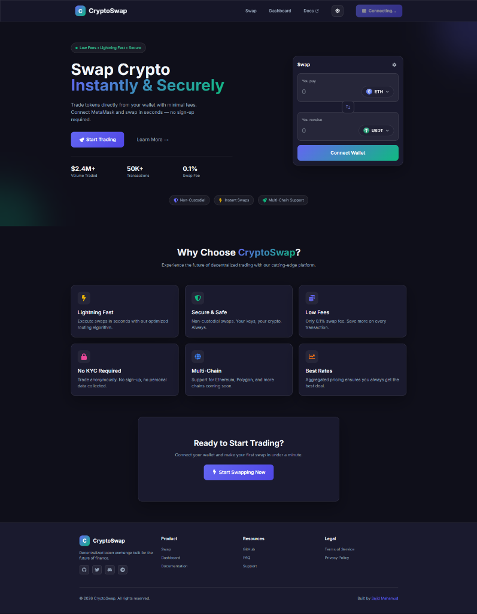
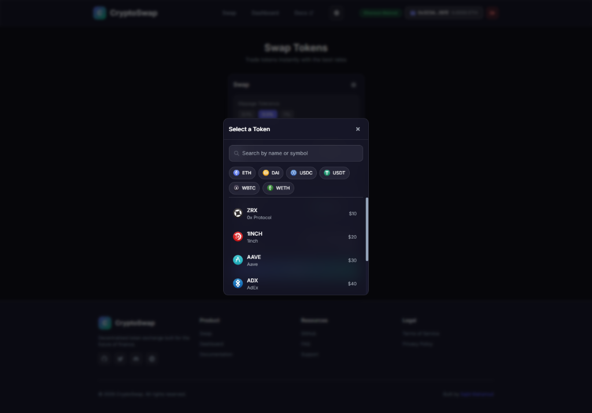
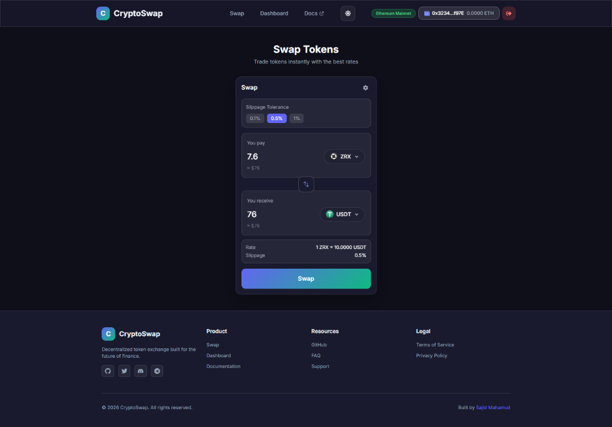
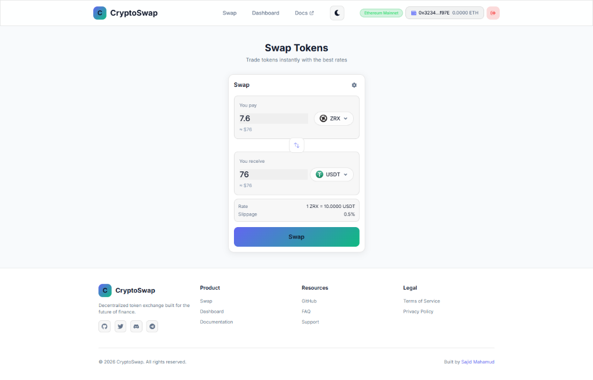
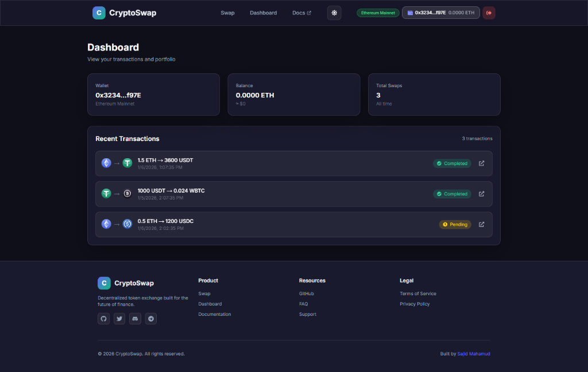
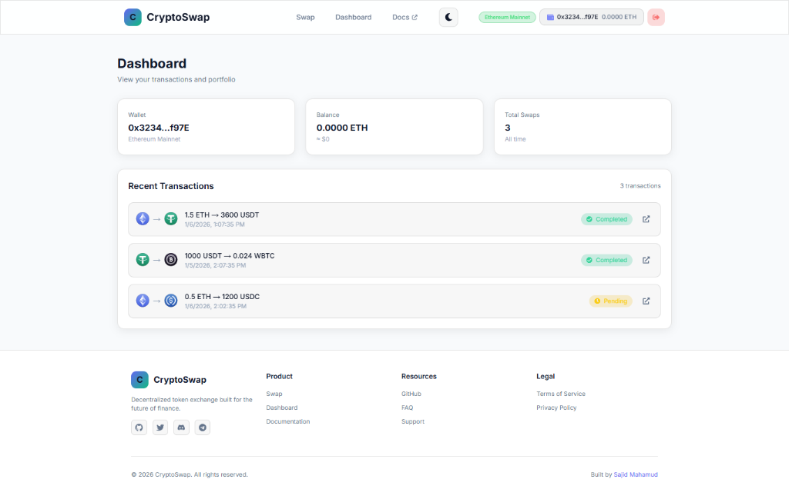

<p align="center">
  
</p>

<h1 align="center">CryptoSwap Protocol</h1>

<p align="center">
  <strong>A Decentralized Token Exchange Protocol for the Future of Finance</strong>
</p>

<p align="center">
  <a href="#abstract">Abstract</a> •
  <a href="#introduction">Introduction</a> •
  <a href="#architecture">Architecture</a> •
  <a href="#features">Features</a> •
  <a href="#screenshots">Screenshots</a> •
  <a href="#getting-started">Getting Started</a> •
  <a href="#roadmap">Roadmap</a>
</p>

<p align="center">
  
  
  
  
</p>

---

## Abstract

CryptoSwap is a non-custodial decentralized exchange (DEX) protocol that enables peer-to-peer token swaps directly from users' wallets. By leveraging smart contract technology on Ethereum and EVM-compatible chains, CryptoSwap eliminates intermediaries, reduces transaction fees, and provides users with complete control over their digital assets.

**Key Metrics:**
- **0.1%** swap fee (industry-leading low cost)
- **< 5 seconds** average transaction confirmation
- **100%** non-custodial (your keys, your crypto)

---

## Introduction

### The Problem

Traditional centralized exchanges (CEXs) present several challenges:

1. **Custody Risk** — Users must trust exchanges with their private keys
2. **KYC Requirements** — Privacy-invasive verification processes
3. **Single Point of Failure** — Vulnerability to hacks, regulatory seizures
4. **High Fees** — Trading fees + withdrawal fees + hidden costs

### Our Solution

CryptoSwap addresses these challenges through:

- **Non-Custodial Architecture** — Trade directly from MetaMask
- **No KYC Required** — Anonymous transactions
- **Decentralized Infrastructure** — No single point of failure
- **Transparent Fees** — Fixed 0.1% swap fee, no hidden costs

---

## Architecture

```
┌─────────────────────────────────────────────────────────────────┐
│                         Client Layer                             │
│  ┌─────────────┐  ┌─────────────┐  ┌─────────────────────────┐  │
│  │   Next.js   │  │   React 18  │  │   TailwindCSS + Glass   │  │
│  │   App Dir   │  │   Context   │  │     Morphism UI         │  │
│  └─────────────┘  └─────────────┘  └─────────────────────────┘  │
└─────────────────────────────────────────────────────────────────┘
                              │
                              ▼
┌─────────────────────────────────────────────────────────────────┐
│                        Web3 Layer                                │
│  ┌─────────────┐  ┌─────────────┐  ┌─────────────────────────┐  │
│  │  Ethers.js  │  │  MetaMask   │  │    WalletConnect        │  │
│  │    v6.x     │  │ Integration │  │     (Planned)           │  │
│  └─────────────┘  └─────────────┘  └─────────────────────────┘  │
└─────────────────────────────────────────────────────────────────┘
                              │
                              ▼
┌─────────────────────────────────────────────────────────────────┐
│                     Smart Contract Layer                         │
│  ┌─────────────────────────────────────────────────────────┐    │
│  │              Transactions.sol (Solidity 0.8.24)          │    │
│  │  • publishTransaction()  • getAllTransactions()          │    │
│  │  • getTransactionCount() • Event emission                │    │
│  └─────────────────────────────────────────────────────────┘    │
└─────────────────────────────────────────────────────────────────┘
                              │
                              ▼
┌─────────────────────────────────────────────────────────────────┐
│                      Blockchain Layer                            │
│         Ethereum Mainnet  •  Sepolia Testnet  •  Polygon         │
└─────────────────────────────────────────────────────────────────┘
```

---

## Features

### Core Features

| Feature | Description |
|---------|-------------|
| 🔗 **MetaMask Integration** | One-click wallet connection with account change detection |
| 💱 **Token Swaps** | Instant token exchanges with real-time rate calculation |
| 🔍 **Smart Token Selector** | Searchable token picker with popular tokens, prices, and quick-select chips |
| ⚙️ **Slippage Control** | Configurable slippage tolerance (0.1%, 0.5%, 1%) |
| 📊 **Transaction History** | View all past swaps with Etherscan links |
| 🌙 **Dark/Light Mode** | Fully themed UI with smooth transitions |
| 📱 **Responsive Design** | Mobile-first, works on all devices |

### Security Features

- ✅ Non-custodial — Private keys never leave your wallet
- ✅ Open source — Fully auditable codebase
- ✅ No backend dependencies — Direct blockchain interaction
- ✅ Environment variable protection — No exposed credentials

---

## Screenshots

### Homepage (Dark Mode)
<p align="center">
  
</p>

### Token Selector Modal
Select from popular tokens or search by name/symbol. Real-time prices and quick-select chips for instant access.
<p align="center">
  
</p>

### Swap Interface (Dark & Light Mode)
<p align="center">
  
  
</p>

### Dashboard (Dark & Light Mode)
<p align="center">
  
  
</p>

---

## Getting Started

### Prerequisites

- Node.js 18+
- MetaMask browser extension
- Sepolia testnet ETH ([Get from faucet](https://sepoliafaucet.com/))

### Installation

```bash
# Clone the repository
git clone https://github.com/sajidmahamud835/Web3.0-Crypto-Swap.git
cd Web3.0-Crypto-Swap

# Install frontend dependencies
cd client
npm install

# Start development server
npm run dev
```

Open [http://localhost:3000](http://localhost:3000) in your browser.

### Smart Contract Deployment (Optional)

```bash
cd smart_contract

# Install dependencies
npm install

# Configure environment
cp .env.example .env
# Edit .env with your PRIVATE_KEY and ALCHEMY_SEPOLIA_URL

# Compile contracts
npm run compile

# Deploy to Sepolia testnet
npm run deploy
```

---

## Tech Stack

| Layer | Technology | Version |
|-------|------------|---------|
| **Frontend** | Next.js | 14.2.4 |
| **UI Framework** | React | 18.3.1 |
| **Styling** | Tailwind CSS | 3.4.16 |
| **Type Safety** | TypeScript | 5.7.2 |
| **Web3** | Ethers.js | 6.13.1 |
| **Smart Contracts** | Solidity | 0.8.24 |
| **Dev Environment** | Hardhat | 2.22.17 |

---

## Roadmap

### Phase 1: Foundation ✅
- [x] MetaMask wallet integration
- [x] Token swap interface
- [x] Transaction history dashboard
- [x] Dark/Light theme support
- [x] Responsive design

### Phase 2: Enhancement (Q2 2026)
- [ ] WalletConnect integration
- [ ] Multi-chain support (Polygon, Arbitrum, Optimism)
- [ ] Limit orders
- [ ] Price charts integration

### Phase 3: Advanced (Q3 2026)
- [ ] Liquidity pools
- [ ] Yield farming
- [ ] Governance token
- [ ] Mobile app (React Native)

---

## Contributing

We welcome contributions! Please see our [Contributing Guide](CONTRIBUTING.md) for details.

1. Fork the repository
2. Create your feature branch (`git checkout -b feature/amazing-feature`)
3. Commit your changes (`git commit -m 'Add amazing feature'`)
4. Push to the branch (`git push origin feature/amazing-feature`)
5. Open a Pull Request

---

## License

This project is licensed under the MIT License - see the [LICENSE](LICENSE) file for details.

---

## Contact

**Muhammad Sajid Mahamud**

- GitHub: [@sajidmahamud835](https://github.com/sajidmahamud835)
- Portfolio: [sajidmahamud835.github.io](https://sajidmahamud835.github.io/)
- LinkedIn: [sajidmahamud835](https://linkedin.com/in/sajidmahamud835)

---

<p align="center">
  <strong>Built with ❤️ for the decentralized future</strong>
</p>
